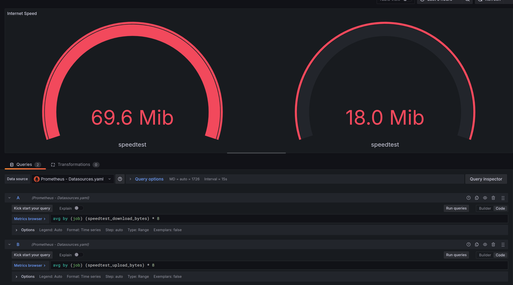

## What is this?

A very very basic POC for speedtest with Prometheus and Grafana

## Dependencies
- Docker https://docs.docker.com/engine/install/ubuntu/
- Docker compose plugin `sudo apt-get update && sudo apt-get install docker-compose-plugin`

## Running this

- In the main directory run `docker compose up`
- To run this in detached mode (background mode) `docker compose up -d`

## Basic debugging
- `docker ps` - there should be three containers
- Are both the prometheus endpoints healthy? `http://localhost:9000/targets`

## Basic wiring
- Everything is exposed onto the host, we're assuming nothing else is running on TCP 9000, 3000 and 9469
- The Docker Compose file specifies `securityisimportant` as the Grafana password
- There's a 
